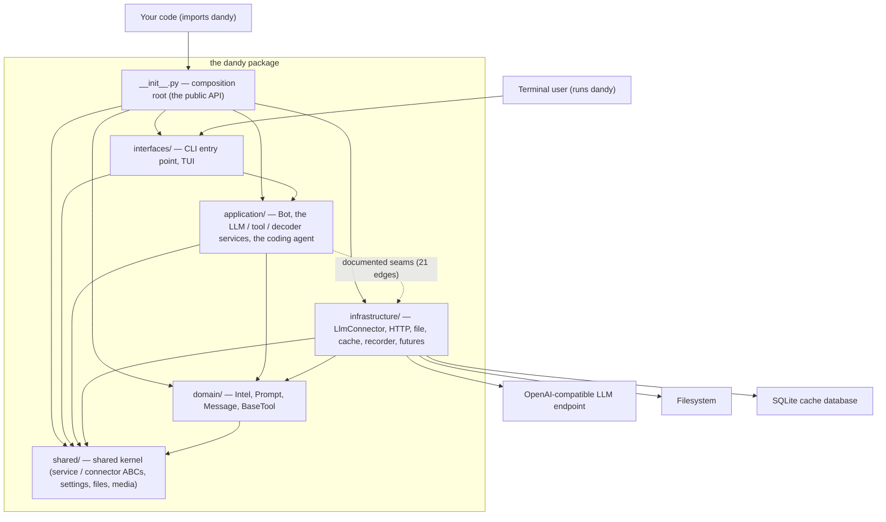

# Layering and Dependency Rules

The physical architecture: five top-level packages under `dandy/`, a shared kernel plus
four layers, with the dependency rules enforced by import-linter contracts in CI.

## The layout

```text
dandy/
├── shared/            # shared kernel
├── domain/            # domain layer (pure)
├── application/       # application layer (use cases)
├── infrastructure/    # infrastructure layer (adapters)
├── interfaces/        # interface layer (entry points)
└── __init__.py        # composition root (the public API)
```

## The dependency graph

The same layout as a graph: solid arrows are the standing rules in the table below, the
dotted arrow is the frozen set of [documented seams](#documented-seams).



The kernel's `files.py` primitives are also used by the domain's prompt builder when a
prompt embeds file or directory contents; everything else that touches a network, disk,
or thread lives in `infrastructure/`.

### `dandy/shared/` — shared kernel

The bottom of the graph. Imports **nothing** from any layer.

- `service/` — `BaseService` / `BaseServiceMixin` / `BaseConnector` ABCs (the service
  pattern, below).
- `conf/` — `DandySettings` singleton, the `dandy.json` fallback loader,
  `get_cli_llm_config`.
- `files.py`, `media.py` — filesystem primitives; base64 media detection.
- `subprocess.py` — the `run_subprocess` command-execution primitive that
  `BaseTool.run_subprocess` delegates to (lives here, not in the domain, so the
  domain layer itself stays I/O-free).
- `exceptions.py` — the `DandyError` hierarchy; `utils.py`, `singleton.py`, `typing/`,
  `debug.py`, `constants.py`.

### `dandy/domain/` — domain

Pure value objects and policy. Imports only `shared`. No adapters, no endpoints, no
threads.

- `intel/` — `BaseIntel`, `BaseListIntel`, `IntelFactory`, `IntelService`.
- `tool/` — `BaseTool` and the tool-descriptor machinery.
- `llm/` — `Prompt` + snippets, token estimation, `Message` / `MessageHistory` /
  `LlmRequestBody` + `compact_message_history`, `LlmOptions`, decoder and tool-call
  value objects, and the pure-string prompt templates under `intelligence/`.

### `dandy/application/` — application

Use cases: orchestration of domain objects against the outside world.

- `bot/` — `Bot`.
- `llm/` — `LlmService` + mixins, `LlmToolService` (the tool-calling loop), `Decoder`,
  diligence handlers.
- `agent/` — the coding agent: `CodingAgent`, session state, planning/coding bots,
  agent toolset.

### `dandy/infrastructure/` — infrastructure

Adapters: everything that touches a network, disk, or thread.

- `llm/` — `LlmConnector`, `LlmConfig`.
- `http/` — `HttpConnector` (retries).
- `file/` — `FileService` + `FileServiceMixin`.
- `cache/` — `MemoryCache`, `SqliteCache`, decorators, key hashing.
- `recorder/` — `Recorder`, renderers, `*_events.py` builders.
- `future/` — `AsyncFuture` thread pool.

### `dandy/interfaces/` — interfaces

Entry points: `cli/` holds the `dandy` console script, the TUI, and the
markdown-to-terminal renderer.

## The rules

| Layer | May import | May NOT import |
|---|---|---|
| `domain` | `shared` | application, infrastructure, interfaces |
| `shared` | — | everything |
| `application` | `domain`, `shared` | infrastructure*, interfaces |
| `infrastructure` | `domain`, `shared` | application*, interfaces |
| `interfaces` | `application`, `shared` | infrastructure* |

\* except the documented seams below.

The root `dandy/__init__.py` is the **composition root**: the single module permitted to
touch every layer. It is a thin re-export of the public API — that is its only job.

## Documented seams

The [service pattern](service_pattern.md) composes adapters into use cases at attribute
access, which means `application` must name some `infrastructure` classes. Rather than
banning composition outright, the contracts **freeze the exact set of composition
points**: each permitted cross-layer import is an individual, exact
`source.module -> imported.module` edge in the contract's `ignore_imports`. The full set
today:

- **application → infrastructure (21 edges):** `Bot` composing the file/http mixins,
  futures, and the recorder wrapper; `LlmService`, `Decoder`, `LlmToolService` reaching
  `LlmConnector`, `LlmConfig`, futures, and the recorder `*_events` builders; five
  diligence modules annotating `LlmConnector` (type-checking only).
- **infrastructure → application (3 edges):** type-checking-only annotations where event
  builders and the connector reference the objects they record or diligence
  (`bot_events` → `Bot`, `decoder_events` → `Decoder`, `LlmConnector` →
  `DiligenceHandler`).
- **interfaces → infrastructure (2 edges):** the welcome banner resolving the CODING
  config's model name, and the CLI entry point (which reaches the seams transitively).

!!! warning

    A new cross-layer import fails `just lint-imports` — and CI — until either the design
    is fixed (move the symbol to a shared layer, or depend through an existing port) or
    its exact edge is added to the right contract with a reason. The contracts are
    transitive: ignoring an entry edge and ignoring a seam edge are different decisions,
    and each is listed deliberately.

## Where do I put new code?

| You are adding... | It goes in... |
|---|---|
| A value object, schema, or prompt text | `domain/` |
| A use case, orchestrator, or bot behavior | `application/` |
| Anything touching HTTP, disk, a DB, or threads | `infrastructure/` |
| A CLI command, TUI widget, or other entry point | `interfaces/` |
| A utility that three or more layers need | `shared/` — the last resort, not the first |

If that table does not answer where something goes, the design is not ready. That is the
point of the exercise.

## Verifying

```bash
just lint-imports
```

Six contracts, all expected to report KEPT. CI runs the same check after the test suite.
