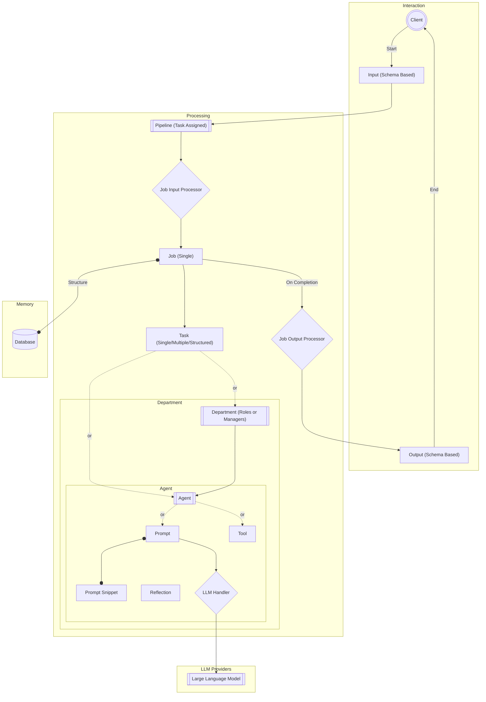

```mermaid

flowchart TD
    subgraph Interaction
        client((("Client")))
        input["Input (Schema Based)"]
        output["Output (Schema Based)"]
    end

    client --->|Start| input
    input ---> pipeline

    subgraph Processing
        pipeline[["Pipeline (Task Assigned)"]]
        job_input_processor{"Job Input Processor"}
        job_output_processor{"Job Output Processor"}
        job["Job (Single)"]
        task["Task (Single/Multiple/Structured)"]
        subgraph Department
            department[["Department (Roles or Managers)"]]
            subgraph Agent
                agent[["Agent"]]
                prompt["Prompt"]
                prompt_snippet["Prompt Snippet"]
                tool["Tool"]
                reflection["Reflection"]
                llm_handler{"LLM Handler"}
            end
        end
    end

    pipeline ---> job_input_processor
    job_input_processor ---> job
    job ---> task
    job o---o|Structure| database
    task -.->|or| department
    task -.->|or| agent
    department ---> agent
    agent -.->|or| tool
    agent -.->|or| prompt
    prompt o---o prompt_snippet
    prompt ---> llm_handler
    llm_handler ---> llm
    job --->|On Completion| job_output_processor
    job_output_processor ---> output
    output --->|End| client

    subgraph LLM Providers
        llm[["Large Language Model"]]
    end

    subgraph Memory
        database[("Database")]
    end


```