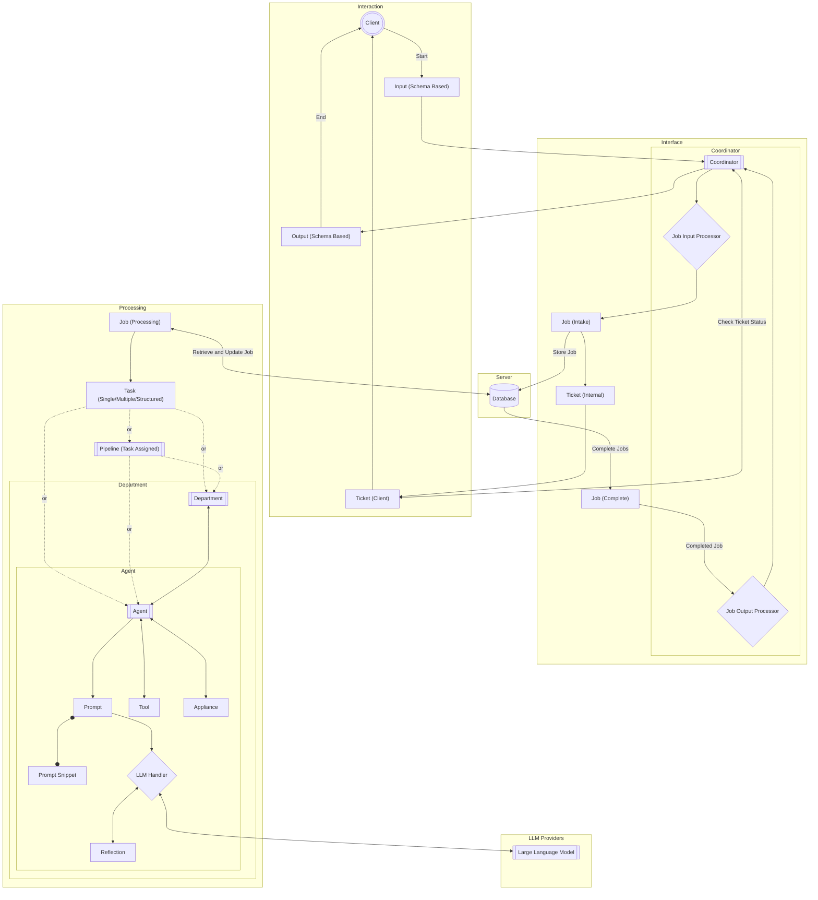

```mermaid
flowchart TD
    subgraph Interaction
        client((("Client")))
        input["Input (Schema Based)"]
        output["Output (Schema Based)"]
        ticket_client["Ticket (Client)"]
    end

    client --->|Start| input
    ticket_client <--->|Check Ticket Status| coordinator
    input ---> coordinator

    subgraph Interface
        subgraph Coordinator 
        coordinator[["Coordinator"]]
        job_input_processor{"Job Input Processor"}
        job_output_processor{"Job Output Processor"}
        end
        job_intake["Job (Intake)"]
        job_complete["Job (Complete)"]
        ticket_internal["Ticket (Internal)"]
    end

    coordinator ---> job_input_processor
    job_input_processor ---> job_intake
    job_intake --->|Store Job| database
    job_intake ---> ticket_internal
    ticket_internal ---> ticket_client
    ticket_client ---> client

    subgraph Processing
        job_processing["Job (Processing)"]
        pipeline[["Pipeline (Task Assigned)"]]
        task["Task (Single/Multiple/Structured)"]
        subgraph Department
            department[["Department"]]
            subgraph Agent
                agent[["Agent"]]
                prompt["Prompt"]
                prompt_snippet["Prompt Snippet"]
                tool["Tool"]
                appliance["Appliance"]
                reflection["Reflection"]
                llm_handler{"LLM Handler"}
            end
        end
    end

    job_processing <--->|Retrieve and Update Job| database
    job_processing ---> task
    task -.->|or| pipeline
    task -.->|or| department
    task -.->|or| agent
    pipeline -.->|or| department
    pipeline -.->|or| agent
    department <---> agent
    agent <---> tool
    agent <---> appliance
    agent ---> prompt
    prompt o---o prompt_snippet
    prompt ---> llm_handler
    llm_handler <---> llm
    llm_handler <---> reflection
    output --->|End| client
    database --->|Complete Jobs| job_complete
    job_complete --->|Completed Job| job_output_processor
    job_output_processor ---> coordinator
    coordinator ---> output

    subgraph LLM Providers
        llm[["Large Language Model"]]
    end

    subgraph Server
        database[("Database")]
    end


```