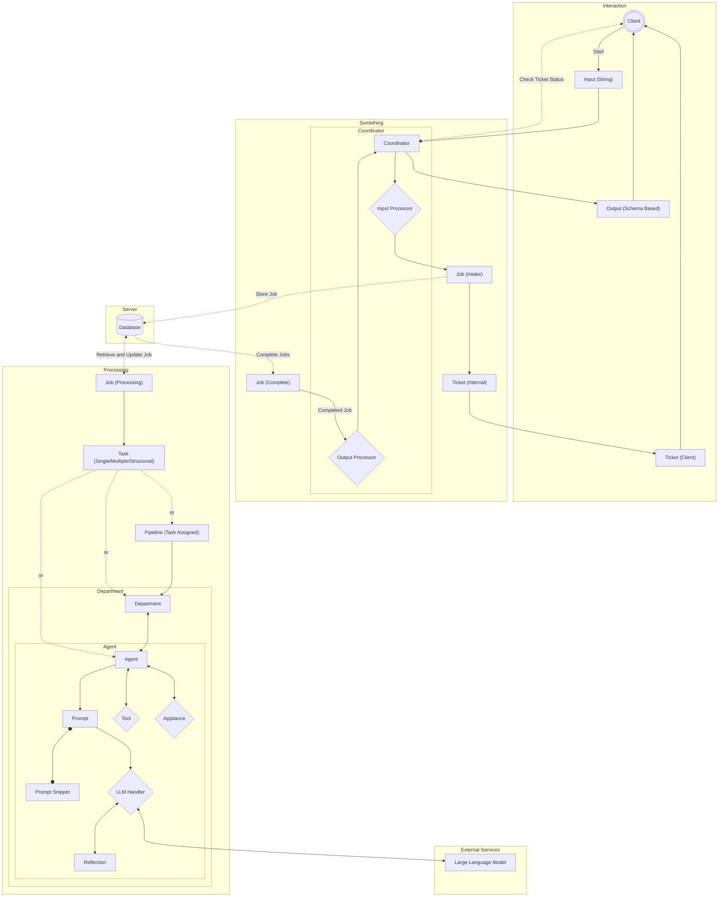

```mermaid
flowchart TD
    subgraph Interaction
        client((("Client")))
        input["Input (String)"]
        output["Output (Schema Based)"]
        ticket_client["Ticket (Client)"]
    end

    subgraph Something
        subgraph Coordinator 
        coordinator["Coordinator"]
        input_processor{"Input Processor"}
        output_processor{"Output Processor"}
        end
        job_intake["Job (Intake)"]
        job_complete["Job (Complete)"]
        ticket_internal["Ticket (Internal)"]
    end

    subgraph External Services
        llm["Large Language Model"]
    end

    subgraph Processing
        job_processing["Job (Processing)"]
        pipeline["Pipeline (Task Assigned)"]
        task["Task (Single/Multiple/Structured)"]
        subgraph Department
            department["Department"]
            subgraph Agent
                agent["Agent"]
                prompt["Prompt"]
                prompt_snippet["Prompt Snippet"]
                tool{"Tool"}
                appliance{"Appliance"}
                reflection["Reflection"]
                llm_handler{"LLM Handler"}
            end
        end
    end

    subgraph Server
        database[("Database")]
    end

    client --->|Start| input
    client <-.->|Check Ticket Status| coordinator
    input ---> coordinator
    coordinator ---> input_processor
    input_processor ---> job_intake
    job_intake -.->|Store Job| database
    job_intake ---> ticket_internal
    ticket_internal ---> ticket_client
    ticket_client ---> client
    database <-.->|Retrieve and Update Job| job_processing
    job_processing ---> task
    task -.->|or| pipeline
    task -.->|or| department
    task -.->|or| agent
    pipeline ---> department
    department <---> agent
    agent <---> tool
    agent <---> appliance
    agent ---> prompt
    prompt o---o prompt_snippet
    prompt ---> llm_handler
    llm_handler <---> llm
    llm_handler <---> reflection
    output ---> client
    database -.->|Complete Jobs| job_complete
    job_complete --->|Completed Job| output_processor
    output_processor ---> coordinator
    coordinator ---> output

```