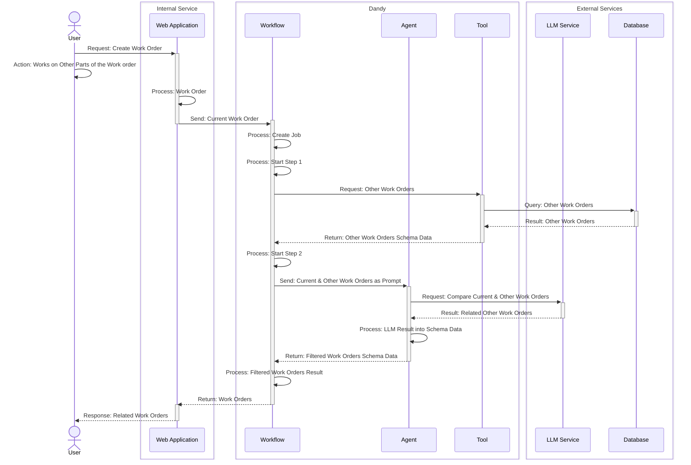

# Process Sequence

### Description
We have a user add a work order to the system and we want to pull all the work orders on that machine and use a large language model to see if any of the other work orders are similar and return the id's and information related to the similare work orders with a description the relationship.

### Operation Sequence

