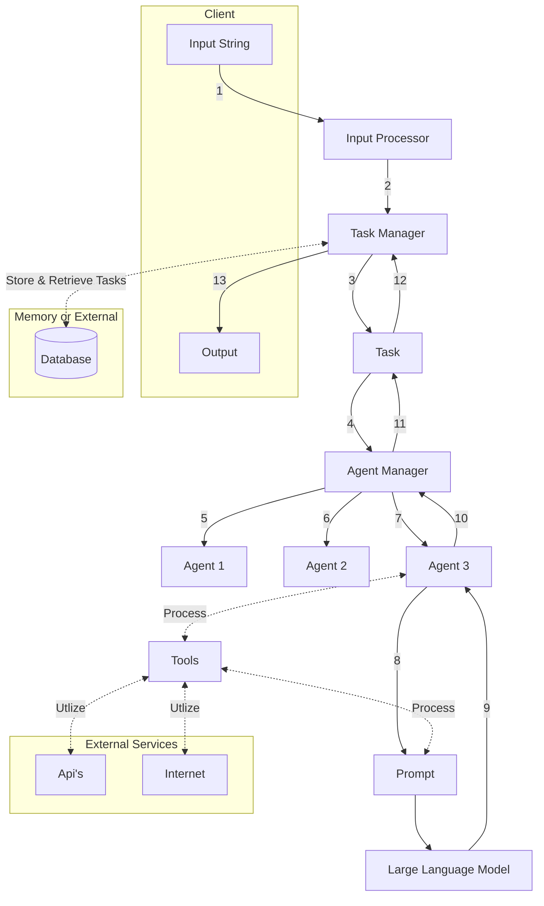

# Project Flow

```mermaid
flowchart TD
    subgraph Client
        input[Input String]
        output[Output]
    end

    subgraph Memory or External
        db[(Database)]
    end
    
    subgraph External Services 
        api[Api's]
        internet[Internet]
    end

    processor[Input Processor]
    task_manager[Task Manager]
    task[Task]
    agent_manager[Agent Manager]
    agent_1[Agent 1]
    agent_2[Agent 2]
    agent_3[Agent 3]
    prompt[Prompt]
    tools[Tools]
    llm[Large Language Model]

    input -->|1| processor
    processor -->|2| task_manager
    
    task_manager -->|3| task
    task_manager <-.->|Store & Retrieve Tasks| db
    task -->|4| agent_manager
    agent_manager -->|5| agent_1
    agent_manager -->|6| agent_2
    agent_manager -->|7| agent_3
    agent_3 -->|8| prompt
    agent_3 <-.->|Process| tools
    tools <-.->|Process| prompt
    tools <-.->|Utlize| api
    tools <-.->|Utlize| internet
    prompt --> llm
    llm -->|9| agent_3
    agent_3 -->|10| agent_manager
    agent_manager -->|11| task
    task -->|12| task_manager
    task_manager -->|13| output
```